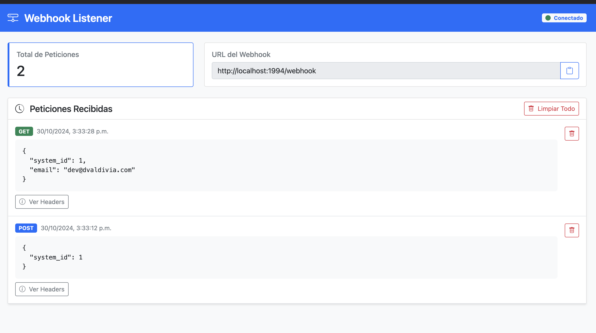

# Webhook Listener for Developers and Debug

## Descripción

Este proyecto es un servidor Node.js que acepta webhooks de diferentes tipos de métodos HTTP (GET, POST, PATCH, etc.) y los almacena para visualización y análisis. La interfaz gráfica se implementa con Socket.io y Bootstrap para mostrar las peticiones recibidas en tiempo real.

## Características

- Acepta y maneja webhooks de diferentes métodos HTTP.
- Almacena y muestra las peticiones recibidas en tiempo real.
- Interfaz gráfica con Socket.io y Bootstrap.
- Soporte para creación y eliminación de endpoints dinámicos.
- Notificaciones en tiempo real para nuevas peticiones.

## Requisitos

- Node.js v22.10.0
- Docker (opcional para contenedorización)

   
