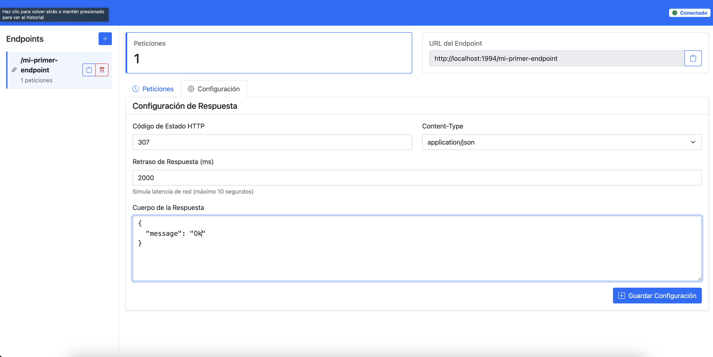
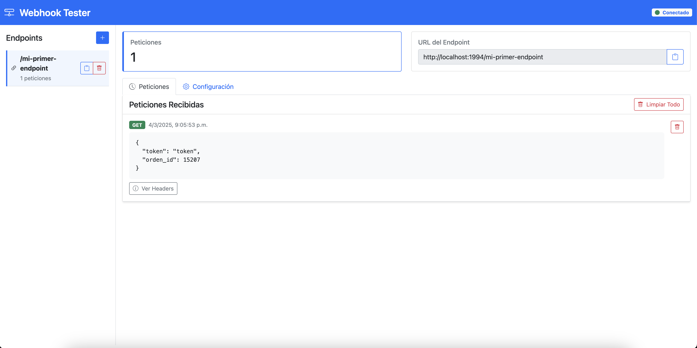

# Webhook Testing Server

A modern, scalable application for testing, debugging, and monitoring webhooks and APIs with dynamic endpoints and customizable responses. Built with a clean MVC architecture, Vue.js frontend, and English throughout.

 

## Features

- ✨ Create custom endpoints on demand
- 🔄 Real-time visualization of incoming requests
- ⚙️ Configure responses per endpoint
- ⏱️ Simulate network latency
- 🔎 Detailed inspection of requests and headers
- 💾 Data persistence with SQLite
- 🌐 Interactive web interface
- 🏗️ Clean MVC architecture with separation of concerns
- ⚡ Vue.js frontend with reactive components and state management

## Architecture

This application follows a layered MVC + Service architecture:

### Backend (Node.js/Express)
```
src/
├── config/          # Database and server configuration
├── controllers/     # HTTP request handlers
├── services/        # Business logic layer
├── repositories/    # Data access layer
├── models/          # Data entities and validation
├── routes/          # API route definitions
├── middleware/      # Cross-cutting concerns
└── utils/           # Helper functions and utilities
```

### Frontend (Vue.js)
```
client/src/
├── components/      # Reusable Vue components
├── views/          # Page-level components
├── stores/         # Pinia state management
├── services/       # API clients and business logic
├── App.vue         # Root component
└── main.js         # Application entry point
```

### Key Components

- **Models**: `Endpoint`, `Request`, `Response` entities with validation
- **Repositories**: Database operations abstraction
- **Services**: Business logic for endpoints, requests, and responses
- **Controllers**: HTTP request/response handling
- **Middleware**: Error handling and request logging
- **Socket Service**: Real-time WebSocket notifications

## Installation

### With Docker (recommended)

1. Make sure you have Docker installed

2. Build the Docker image:
   ```bash
   docker build -t webhook-tester .
   ```

3. Run the container:
   ```bash
   docker run -p 1994:1994 -v webhookdata:/app/data webhook-tester
   ```

4. Access the application in your browser:
   ```
   http://localhost:1994
   ```

### Manual Installation

1. Make sure you have Node.js installed (v14 or higher)

2. Clone this repository or download the files

3. Install dependencies:
   ```bash
   npm install
   ```

4. Install frontend dependencies:
   ```bash
   npm run client:install
   ```

5. Build the frontend:
   ```bash
   npm run client:build
   ```

6. Start the application:
   ```bash
   npm start
   ```

7. Access the application in your browser:
   ```
   http://localhost:1994
   ```

### Development Mode

For development with hot reload:

1. Start the backend server (port 1995):
   ```bash
   npm run dev
   ```

2. In another terminal, start the Vue.js development server (port 1994):
   ```bash
   npm run client:dev
   ```

3. Access the development frontend:
   ```
   http://localhost:1994
   ```

**Note**: The frontend (port 1994) automatically proxies API calls and WebSocket connections to the backend (port 1995). Webhook URLs will correctly point to the server port (1995).

## Usage

### Create a New Endpoint

1. Click the `+` button in the Endpoints section
2. Enter the endpoint name (e.g., `payments`)
3. Click "Create"

This will create a new endpoint available at `http://localhost:1994/payments`

### Configure Custom Responses

1. Select an endpoint from the list
2. Go to the "Configuration" tab
3. Configure:
    - HTTP status code (e.g., 200, 201, 400, 500)
    - Response Content-Type
    - Response delay (in milliseconds)
    - Response body (JSON, text, HTML, etc.)
4. Click "Save Configuration"

### View Received Requests

1. Select an endpoint from the list
2. Go to the "Requests" tab
3. All received requests will be displayed sorted by date
4. Click "View Headers" to see additional details

### Test the Endpoint

You can send requests to the created endpoint using tools like curl, Postman, or from your application:

```bash
# Example with curl
curl -X POST http://localhost:1994/payments \
  -H "Content-Type: application/json" \
  -d '{"amount": 100, "currency": "USD"}'
```

### Integration with Your Application

1. Configure your application to send requests to the endpoint URL (example: `http://localhost:1994/payments`)
2. Received requests will automatically appear in the interface with real-time updates

## API Documentation

### Endpoints Management
- `GET /api/endpoints` - List all endpoints
- `POST /api/endpoints` - Create new endpoint
- `DELETE /api/endpoints/:path` - Delete endpoint

### Requests Management
- `GET /api/endpoints/:path/requests` - Get requests for endpoint
- `DELETE /api/endpoints/:path/requests/:id` - Delete specific request
- `DELETE /api/endpoints/:path/requests` - Clear all requests for endpoint

### Response Configuration
- `GET /api/endpoints/:path/response` - Get response configuration
- `PUT /api/endpoints/:path/response` - Update response configuration

### Dynamic Webhooks
- `ALL /:path` - Handle incoming webhook requests

## Development

The project uses:
- **Express.js** for the web server
- **Socket.IO** for real-time updates
- **SQLite** for data persistence
- **Bootstrap 5** for the frontend UI

### Project Structure Benefits

- **Testability**: Each layer can be unit tested independently
- **Maintainability**: Clear separation of concerns
- **Scalability**: Easy to add new features without affecting existing code
- **Readability**: Well-organized code structure

## Use Cases

- Development and testing of payment integrations
- Third-party webhook debugging
- Testing notification systems
- API simulation for frontend development
- Education and demonstration of APIs
- Load testing and performance analysis

## Configuration

Environment variables:
- `PORT` - Server port (default: 1994)
- `NODE_ENV` - Environment (development/production)

## License

MIT

## Contributing

Contributions are welcome! Please follow the established architecture patterns and ensure all code is in English.